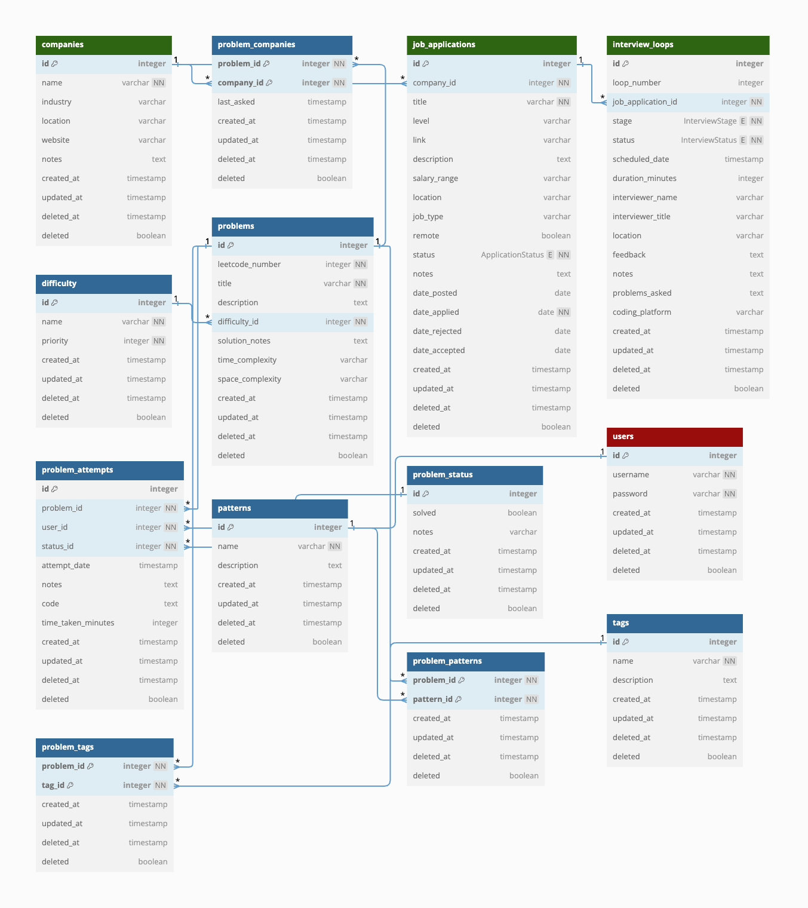

# fluffy-fortnight

project for tracking dsa problems and job applications.


## Install 

clone this repo and cd into it.


init the db

```bash
flask --app ff init-db
```

and run the app

```bash
flask --app ff run --debug
```


## problems tables




## job_applications tables


## user tables

